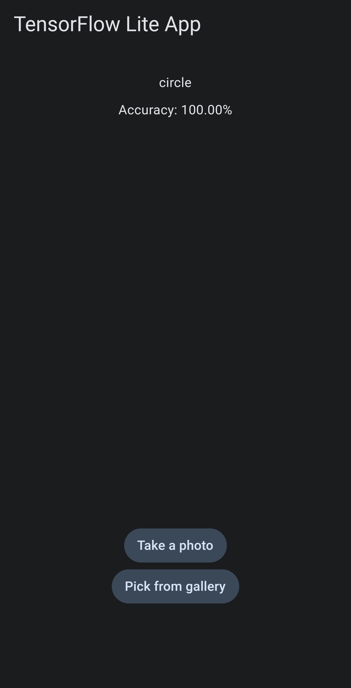

gmshimg: Geometrical Shape Recognition Model and GUI
====================================================

Overview
--------

gmshimg is a simple AI model and accompanying GUI for recognizing simple geometrical objects such as circles, rectangles, and triangles. The model is based on computer vision techniques and deep learning algorithms. With gmshimg, you can easily identify geometric shapes in an image, making it a useful tool for various applications in computer graphics, engineering, and mathematics.

Requirements
------------

To use gmshimg, you will need the following software and tools:

*   [Pipenv](https://pipenv.pypa.io/en/latest/): A virtual environment manager for Python.
*   Cmake: A cross-platform open-source build system.
*   C++ compiler: A compiler for the C++ programming language.
*   Flutter: A mobile app SDK for building high-performance, high-fidelity, apps for iOS and Android.

Model Architecture
------------------

The gmshimg model is based on convolutional neural networks (CNNs), which are a type of deep learning model commonly used in image recognition tasks. The model takes an input image and outputs a prediction of the geometric shape present in the image.

GUI Application
-----------

The accompanying GUI provides a user-friendly interface for using the gmshimg model. The GUI allows you to select an image and obtain a prediction of the geometric shapes present in the image. A preview of the GUI is shown below:



Installation
------------

The following steps will guide you through the installation process of gmshimg.

### Clone the repository:

```bash
git clone https://github.com/vnepogodin/gmshimg.git
cd gmshimg
```

To setup pipenv environment run the following commands:
```bash
pipenv install
pipenv shell
```

### Generation of dataset

To generate the dataset needed for training the AI model, you need to perform the following actions:

a. Generating images for dataset
```bash
cd tools
python generate_images_for_dataset.py
tar -czf geometric_shapes_images.tar.gz geometric_shapes_images
```

b. Using the generated images to create the dataset:
```bash
cd ../my_dataset
mkdir -p ~/tensorflow_datasets/downloads/manual/
cp ../tools/geometric_shapes_images.tar.gz ~/tensorflow_datasets/downloads/manual/
tfds build
```

### Train the AI model using the generated dataset.
To train model you need to run these commands:

1) Training of the model
```bash
cd ..
python train_model.py
```

2) Run prediction with trained model
```bash
python dataset_test.py
```

### Using existing datasets

- https://www.kaggle.com/datasets/smeschke/four-shapes

- https://www.kaggle.com/datasets/cactus3/basicshapes

### Training of the model using Teachable Machine

Follow these steps:

1) Go to https://teachablemachine.withgoogle.com and click **Get Started**.

2) Choose **Standard Image Model**.

3) Add the classes and edit the labels of each class.

create labels in this order: "circle", "rectangle", "triangle".

4) Add your images for the dataset by clicking **Upload** under each class

5) Click **Train Model** to train the mode.

6) After the training completes, test the model with other plant images (optional).

7) Export the model by clicking **Export Model** on the Preview panel, and click **Download model**.

The downloaded model will contain: model (*.h5), file containing labels (labels.txt).

Rename downloaded model (*.h5) to gmshimg.h5.

### Convert the trained model to TensorFlow Lite format
You need to run this command to convert .h5 format model to .tflite,
for mobile and GUI use.

```bash
python convert_model_to_tflite.py
```


### Building tensorflow lite fron source (for Windows, Linux, MacOS)

1) Clone tensorflow repository
```bash
git clone https://github.com/tensorflow/tensorflow.git tensorflow_src
```

2) Create build folder
```bash
mkdir tflite_build
cd tflite_build
```

3) Build in release mode
```bash
cmake ../tensorflow_src/tensorflow/lite
cmake --build . -j
```

4) Copy the built library
```bash
cd ../tutapp
mkdir blobs
cp * blobs/
```

### Download tensorflow lite (for Android)

###### On Windows use `.\install.bat` instead of `./install.sh`.

```bash
cd tutapp
./install.sh
```

### Build and Run GUI


```bash
cd tutapp
flutter run
```


### Why did I do that? (yet another AI?)

I made that project to learn how to develop AI,
learn how to work with tensorflow framework; make a dataset for my model.
So that's about it ;)

### Credits

* https://www.tensorflow.org/lite/guide/reduce_binary_size.
* https://www.tensorflow.org/datasets/catalog/eurosat.
* https://www.tensorflow.org/datasets/overview.
* https://github.com/tensorflow/datasets/blob/master/tensorflow_datasets/image_classification/mnist.py.
* https://www.tensorflow.org/tutorials/images/classification.
* https://pub.dev/packages/tflite_flutter.
